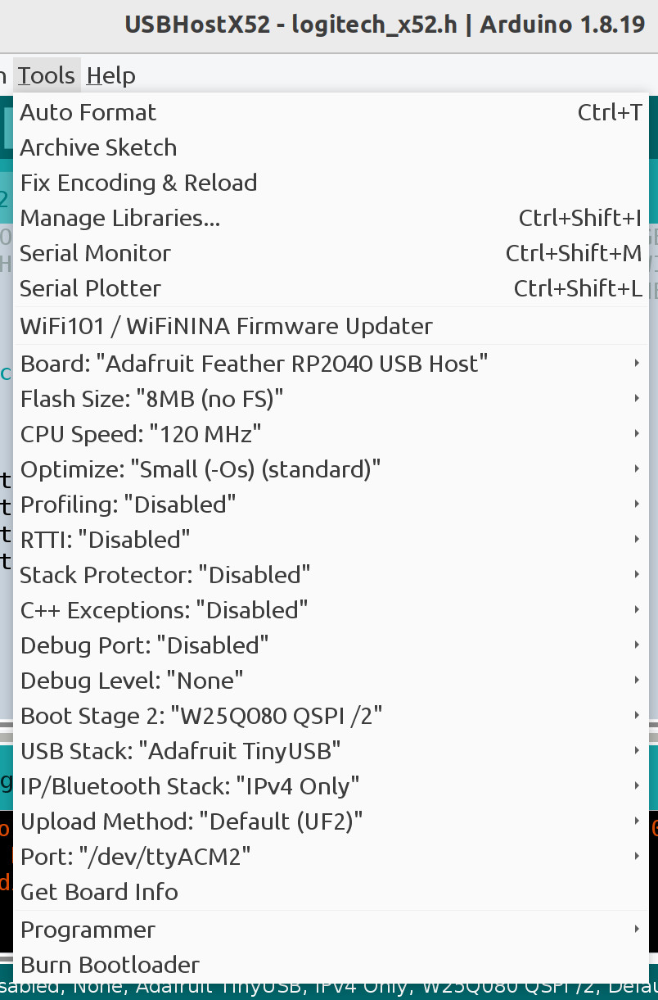

# USBHostX52 -- Break Out Logitech X52 Flight Joystick

USBHostX52 uses the RP2040 PICO PIO library USB host feature to extract
control values from a Logitech X52 flight joystick. The control values
can be used to control motors and servos. This is an example program that
does not do anything useful except print X52 joystick control values to
the serial console.

## Prepare the USBHostX52 Adapter Hardware

* Adafruit Feather RP2040 with USB Type A Host
* Snap-on Enclosure for Adafruit Feather RP2040 USB Host

Put the RP2040 board in firmware update mode by pressing and holding the
BOOT button then pressing and releasing the RESET button. Then release
the BOOT button. A USB flash drive should appear named RPI-RP2.

Drag and drop the [USBHostX52 UF2
file](https://github.com/controllercustom/USBHostX52/releases/download/r2024-12-22/USBHostX52.ino.adafruit_feather_usb_host.uf2)
on the RPI-RP2 drive.  After a few seconds, the drive disappears
indicating the update is done. The adapter is ready to use.

Sample output
```
USBHostX52
HID device address = 1, instance = 0 is mounted
VID = 06a3, PID = 075c
Logitech X52 connected
Device attached, address = 1
Device 1: ID 06a3:075c
Device Descriptor:
  bLength             18                                                                                              
  bDescriptorType     1                                                                                               
  bcdUSB              0200                                                                                            
  bDeviceClass        0                                                                                               
  bDeviceSubClass     0                                                                                               
  bDeviceProtocol     0
  bMaxPacketSize0     8
  idVendor            0x06a3
  idProduct           0x075c
  bcdDevice           2100
  iManufacturer       1     Logitech
  iProduct            2     X52 H.O.T.A.S.
  iSerialNumber       0     
  bNumConfigurations  1
Device 1: ID 06a3:075c Logitech X52 H.O.T.A.S.
X:1024,Y:1024,twist:512,throttle:112,thr_small:255,thr_large:0,thr_slider:54,top rotary red,dpad:0,mouse_x:8,mouse_y:8
```

## Building from source code

### Arduino IDE Setup

Adafruit provides a tutorial on installing the Arduino IDE for this board.

https://learn.adafruit.com/adafruit-feather-rp2040-with-usb-type-a-host/arduino-ide-setup

### Libraries

Install the following libraries using the IDE Library manager.

* "Adafruit TinyUSB Library" by Adafruit
* "Pico PIO USB" by sekigon-gonnoc

### Build Options

The following are the options that must be changed.

* Set "Board" to "Adafruit Feather RP2040 USB Host"
* Set "CPU Speed" to 120 MHz.
* Set "USB Stack" to "Adafruit TinyUSB".


